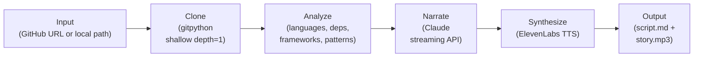

## From GitHub Repos to Audio Stories

*Agentic Development: 10 Lessons from 8,481 AI Coding Sessions*

What if you could listen to a codebase?

Not read documentation. Not scan source files. Listen -- like a podcast episode about FastAPI's architecture, or a nature documentary narrating how Django evolved in the wild.

That is exactly what code-tales does. Give it a GitHub URL, pick one of 9 narrative styles, and in under two minutes you get a fully synthesized audio story about the repository. Clone, analyze, narrate with Claude, synthesize with ElevenLabs. Four pipeline stages. One command.

```bash
code-tales generate --repo https://github.com/tiangolo/fastapi --style documentary
```

This is post 9 of 11 in the Agentic Development series. The companion repo is at [github.com/krzemienski/code-tales](https://github.com/krzemienski/code-tales). Everything quoted here is real code you can read, run, and extend.

---

### The Pipeline Architecture

The core abstraction is a four-stage pipeline orchestrated by a single class. Here is the actual orchestrator:

```python
# From: src/code_tales/pipeline/orchestrate.py

class CodeTalesPipeline:
    """Orchestrates the full code-tales pipeline.

    Stages:
      1. Resolve repository (clone URL or validate local path)
      2. Analyze repository structure and metadata
      3. Generate narration script via Claude
      4. Synthesize audio via ElevenLabs (or save text only)
    """

    def generate(
        self,
        repo_url_or_path: str,
        style_name: str,
        output_dir: Optional[Path] = None,
    ) -> AudioOutput:
```

The `generate` method runs all four stages sequentially with Rich progress bars showing real-time status. The key design decision: every stage is independently importable. You can call `analyze_repository` without cloning, or `generate_script` without synthesizing audio. The pipeline composes; it does not mandate.



The pipeline resolution logic handles both remote URLs and local paths:

```python
# From: src/code_tales/pipeline/orchestrate.py

def _resolve_repo(self, repo_url_or_path: str) -> tuple[Path, Optional[Path]]:
    if repo_url_or_path.startswith(("http://", "https://", "git@")):
        temp_dir = Path(tempfile.mkdtemp(prefix="code-tales-"))
        repo_path = clone_repository(
            url=repo_url_or_path,
            target_dir=temp_dir,
            depth=self.config.clone_depth,
        )
        return repo_path, temp_dir

    # Local path
    local = Path(repo_url_or_path).expanduser().resolve()
    if not (local / ".git").exists():
        raise ValueError(
            f"Local path is not a git repository (no .git dir): {local}"
        )
    return local, None
```

Shallow clones (`depth=1`) are the default. We need the file tree, not the full commit history. This keeps clone times under a few seconds for most repositories.

---

### The Analysis Engine

Before Claude ever sees a repository, the analysis stage extracts structured metadata. This is where code-tales distinguishes itself from "just paste the README into Claude." The analyzer detects languages by file extension counts, extracts dependencies from 8 different package manager formats, identifies frameworks, and recognizes architectural patterns.

The dependency extraction alone covers `package.json`, `requirements.txt`, `pyproject.toml`, `Cargo.toml`, `go.mod`, `Gemfile`, `Package.swift`, and `pom.xml`:

```python
# From: src/code_tales/pipeline/analyze.py

def _extract_dependencies(repo_path: Path) -> list[Dependency]:
    deps: list[Dependency] = []

    # package.json (npm/yarn)
    pkg_json = repo_path / "package.json"
    if pkg_json.exists():
        data = json.loads(pkg_json.read_text(encoding="utf-8"))
        for section in ("dependencies", "devDependencies", "peerDependencies"):
            for name, version in (data.get(section) or {}).items():
                deps.append(
                    Dependency(name=name, version=str(version), source="package.json")
                )

    # ... repeated for requirements.txt, pyproject.toml, Cargo.toml,
    #     go.mod, Gemfile, Package.swift, pom.xml
```

The pattern detection identifies monorepos, microservices, REST APIs, GraphQL schemas, CLI tools, web applications, mobile apps, MVC architectures, test coverage, CI/CD pipelines, and containerization. All heuristic-based, all derived from directory structure and file presence -- no LLM calls required.

```python
# From: src/code_tales/pipeline/analyze.py

def _detect_patterns(repo_path: Path) -> list[str]:
    patterns: list[str] = []

    # Monorepo detection
    workspace_files = [
        repo_path / "pnpm-workspace.yaml",
        repo_path / "lerna.json",
        repo_path / "nx.json",
        repo_path / "rush.json",
    ]
    if any(f.exists() for f in workspace_files):
        patterns.append("Monorepo")
```

This matters because the structured analysis gives Claude specific, quantified data to work with -- not just "here's a bunch of source code, figure it out." The prompt includes file counts, language percentages, dependency lists, detected frameworks, and architectural patterns. Claude narrates from data, not from guesswork.

All of this feeds into a Pydantic model that constrains the data shape throughout:

```python
# From: src/code_tales/models.py

class RepoAnalysis(BaseModel):
    name: str
    description: str = ""
    languages: list[Language] = Field(default_factory=list)
    dependencies: list[Dependency] = Field(default_factory=list)
    file_tree: str = ""
    key_files: list[FileInfo] = Field(default_factory=list)
    total_files: int = 0
    total_lines: int = 0
    frameworks: list[str] = Field(default_factory=list)
    patterns: list[str] = Field(default_factory=list)
    readme_content: Optional[str] = None
```

---

### Nine Styles, Nine Different Experiences

This is the feature that makes code-tales more than a utility. Each of the 9 narrative styles is defined as a YAML configuration with its own tone directive, section structure template, ElevenLabs voice ID, and voice synthesis parameters. The same repository analyzed in "documentary" style and "fiction" style produces fundamentally different audio experiences.

Here is the documentary style -- think David Attenborough observing code as a living ecosystem:

```yaml
# From: src/code_tales/styles/documentary.yaml

name: documentary
description: A nature documentary-style narration that observes the codebase
  as a living ecosystem, in the tradition of David Attenborough.
tone: Measured, observational, and quietly awestruck. Speak as if witnessing
  remarkable natural phenomena. Use present tense for immediacy.
voice_id: "onwK4e9ZLuTAKqWW03F9"
voice_params:
  stability: 0.7
  similarity_boost: 0.8
  style: 0.3
example_opener: |
  Here we observe a remarkable specimen of software engineering,
  quietly going about its work in the digital wilderness...
```

Now compare that to the fiction style -- literary drama with characters and conflict:

```yaml
# From: src/code_tales/styles/fiction.yaml

name: fiction
description: A literary fiction narrative that transforms code into a
  dramatic story with characters, conflict, and emotional arc.
tone: Lyrical, evocative, and dramatic. Write as if describing a novel's
  setting and characters. Use vivid metaphors and literary devices.
voice_id: "EXAVITQu4vr4xnSDxMaL"
voice_params:
  stability: 0.3
  similarity_boost: 0.7
  style: 0.8
example_opener: |
  In the vast digital landscape, there existed a repository that dared
  to dream in a language most could not speak...
```

Notice the voice parameter differences. Documentary uses high stability (0.7) and low style (0.3) -- controlled, authoritative delivery. Fiction drops stability to 0.3 and cranks style to 0.8 -- more expressive, more emotional range. These are not arbitrary numbers. They map directly to ElevenLabs' voice synthesis parameters that control how much freedom the TTS model has in its delivery.

The full roster: debate (structured argument for and against design decisions), documentary, executive (crisp leadership briefing), fiction, interview (Q&A with an expert), podcast (casual tech talk with hot takes), storytelling (hero's journey), technical (dense engineering review), and tutorial (educational walkthrough).

The podcast style captures a completely different register:

```yaml
# From: src/code_tales/styles/podcast.yaml

name: podcast
tone: Casual, enthusiastic, and opinionated. Sound like you've actually
  used this project and have genuine thoughts. Use filler phrases
  naturally. Share hot takes.
voice_params:
  stability: 0.5
  similarity_boost: 0.7
  style: 0.6
example_opener: |
  Hey everyone, welcome back! So I've been digging into this really
  interesting repo this week and honestly, I had to record an
  episode about it...
```

Each style also defines a `structure_template` that guides Claude's section organization. The executive style forces "Executive Summary, Key Metrics, Architecture Overview, Risk Assessment, Recommendations." The storytelling style uses "Once Upon a Time, The Call to Adventure, The Journey, The Breakthrough, The Legacy." Same data, completely different narrative architecture.

---

### The Narration Engine

The narration stage builds a detailed prompt from the analysis data and sends it to Claude's streaming API. The system message sets the narrative voice, and the user message provides the full repository analysis:

```python
# From: src/code_tales/pipeline/narrate.py

with client.messages.stream(
    model=config.claude_model,
    max_tokens=config.max_script_tokens,
    system=system_message,
    messages=[{"role": "user", "content": prompt}],
) as stream:
    raw_text = stream.get_final_message().content[0].text
```

Streaming prevents HTTP timeouts on long scripts. The system message includes explicit formatting rules for audio output -- no bullet points, no tables, natural speech patterns, contractions, flowing sentences. Critical for TTS quality: the text Claude generates will be spoken aloud, not read on a screen.

The parser then splits Claude's response on markdown headings, extracts voice directions from bracketed text (like `[speak slowly]` or `[with enthusiasm]`), and strips formatting artifacts:

```python
# From: src/code_tales/pipeline/narrate.py

def _clean_content(content: str) -> str:
    # Remove bold/italic markers
    content = re.sub(r"\*\*([^*]+)\*\*", r"\1", content)
    content = re.sub(r"\*([^*]+)\*", r"\1", content)
    # Remove inline code backticks
    content = re.sub(r"`([^`]+)`", r"\1", content)
    # Remove code blocks
    content = re.sub(r"```[\s\S]*?```", "", content)
    return content.strip()
```

This is one of those details that seems trivial but matters enormously. If you leave markdown formatting in the text that goes to TTS, the synthesized audio sounds wrong. Asterisks create unnatural pauses. Backticks confuse the speech model. The cleaning step bridges two fundamentally different output modalities.

---

### The Audio Synthesis Layer

ElevenLabs integration includes retry logic with exponential backoff, per-style voice selection, and graceful degradation to text-only output:

```python
# From: src/code_tales/pipeline/synthesize.py

payload = {
    "text": text,
    "model_id": "eleven_multilingual_v2",
    "voice_settings": {
        "stability": voice_params.get("stability", 0.5),
        "similarity_boost": voice_params.get("similarity_boost", 0.75),
        "style": voice_params.get("style", 0.0),
        "use_speaker_boost": True,
    },
    "output_format": "mp3_44100_128",
}

for attempt in range(_MAX_RETRIES):
    with httpx.Client(timeout=120.0) as client:
        response = client.post(url, json=payload, headers=headers)
    if response.status_code == 200:
        return response.content
    if response.status_code == 429:
        delay = _RETRY_BASE_DELAY * (2 ** attempt)
        time.sleep(delay)
        continue
```

The text output is always generated regardless of whether audio synthesis succeeds. If you do not have an ElevenLabs API key, you still get a complete narration script as markdown.

---

### The Build Story

Code-tales was built using the parallel AI development patterns described earlier in this series. 636 commits across 90 worktree branches. 91 specification documents. 37 validation gates.

The audio debugging saga deserves special mention: 9 commits to fix race conditions in the synthesis pipeline. The problem was subtle -- when sections were concatenated for TTS, the natural pause markers between sections were being dropped during the markdown cleaning step. This produced audio where one section ran directly into the next without any breathing room. The fix was to build the TTS text separately from the display text, preserving paragraph breaks as natural pauses:

```python
# From: src/code_tales/pipeline/synthesize.py

_PAUSE_BETWEEN_SECTIONS = "\n\n"  # Natural paragraph break for TTS

def _build_tts_text(script: NarrationScript) -> str:
    parts: list[str] = []
    for section in script.sections:
        parts.append(section.heading + ".")
        parts.append(section.content)
    return _PAUSE_BETWEEN_SECTIONS.join(parts)
```

Simple in retrospect. Nine commits to arrive at two newline characters. That is debugging audio pipelines for you.

---

### The CLI Experience

The user-facing interface is a Click CLI with three commands -- `generate`, `preview`, and `list-styles`:

```python
# From: src/code_tales/cli.py

@cli.command()
@click.option("--repo", "repo_url", help="GitHub repository URL.")
@click.option("--path", "local_path", type=click.Path(exists=True, path_type=Path))
@click.option("--style", "-s", required=True)
@click.option("--output", "-o", "output_dir", type=click.Path(path_type=Path))
@click.option("--no-audio", is_flag=True, default=False)
def generate(ctx, repo_url, local_path, style, output_dir, no_audio):
    pipeline = CodeTalesPipeline(config=config)
    result = pipeline.generate(
        repo_url_or_path=target,
        style_name=style,
        output_dir=out_dir,
    )
```

All configuration flows through environment variables via a Pydantic config model:

```python
# From: src/code_tales/config.py

class CodeTalesConfig(BaseModel):
    anthropic_api_key: Optional[str] = None
    elevenlabs_api_key: Optional[str] = None
    output_dir: Path = Field(default_factory=lambda: Path("./output"))
    clone_depth: int = 1
    max_files_to_analyze: int = 100
    max_file_size_bytes: int = 100_000
    claude_model: str = "claude-sonnet-4-6"
    max_script_tokens: int = 4096
```

The style system is extensible via YAML. Drop a new `.yaml` file in the styles directory -- or load one from any path at runtime -- and you have a new narrative voice. The README includes a full example of creating a "noir detective" style. The style registry handles loading, validation, and lookup:

```python
# From: src/code_tales/styles/registry.py

class StyleRegistry:
    def load_builtin_styles(self) -> dict[str, StyleConfig]:
        yaml_files = sorted(_STYLES_DIR.glob("*.yaml"))
        for yaml_file in yaml_files:
            style = self._load_yaml(yaml_file)
            self._styles[style.name] = style
        return self._styles

    def get_style(self, name: str) -> StyleConfig:
        if name not in self._styles:
            available = ", ".join(sorted(self._styles.keys()))
            raise KeyError(
                f"Style '{name}' not found. Available styles: {available}"
            )
        return self._styles[name]
```

---

### What I Learned

The most counterintuitive lesson: the analysis stage matters more than the narration stage. Give Claude mediocre data and you get mediocre narration regardless of how good the style prompt is. Give Claude precise, quantified analysis -- "47.3% Python, 12 dependencies including FastAPI and Pydantic, REST API + CLI Tool patterns detected, 23,000 lines across 145 files" -- and the narration practically writes itself.

The second lesson: voice parameters are a design surface. Changing ElevenLabs stability from 0.7 to 0.3 transforms a documentary into a dramatic reading. These three numbers -- stability, similarity_boost, style -- are the audio equivalent of typography choices. They deserve the same attention.

The third lesson: text-to-speech requires a different writing style than text-to-screen. Every markdown artifact that slips through the cleaning stage is audible. Every bullet point that should have been a sentence creates an awkward pause. When you build a pipeline that crosses modalities, the boundary between them is where the bugs live.

Companion repo: [github.com/krzemienski/code-tales](https://github.com/krzemienski/code-tales)

---

*Part 9 of 11 in the [Agentic Development](https://github.com/krzemienski/agentic-development-guide) series.*
